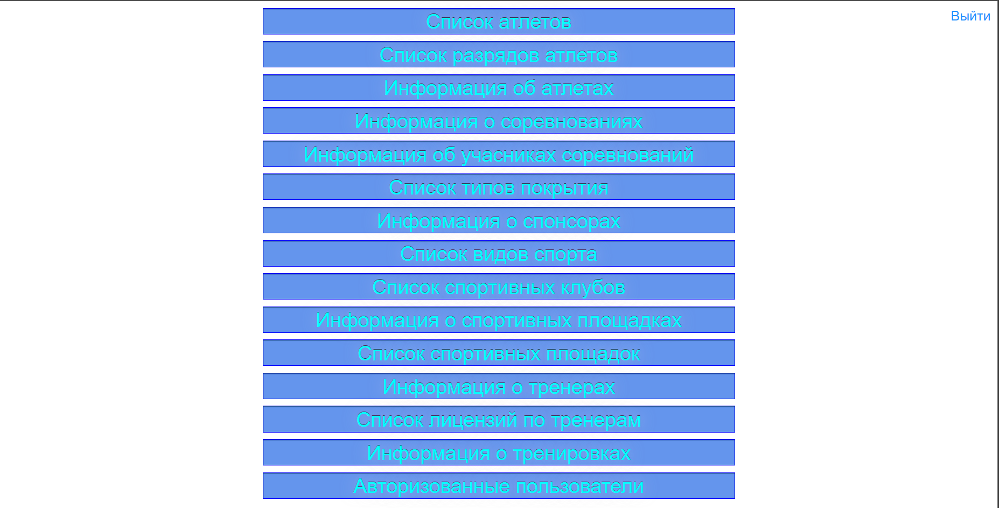
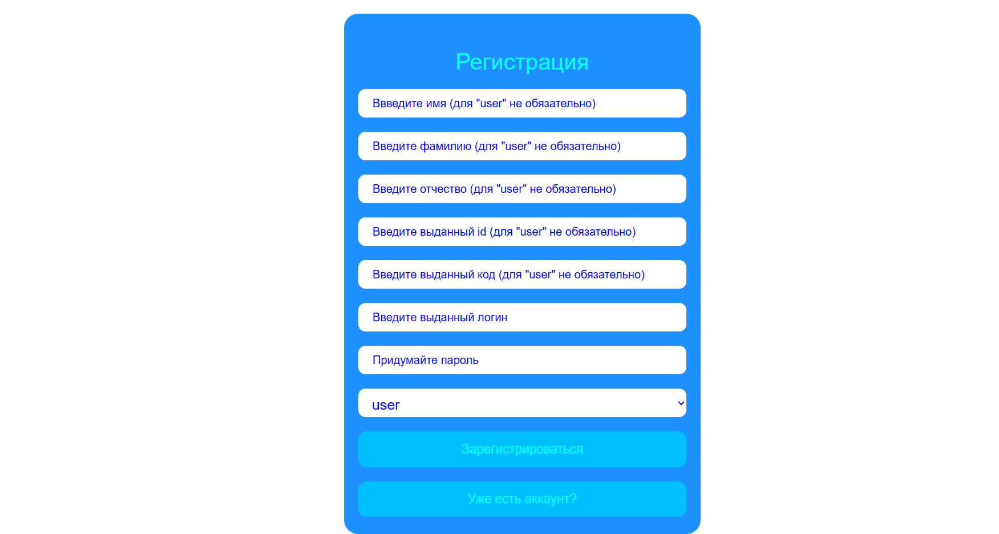
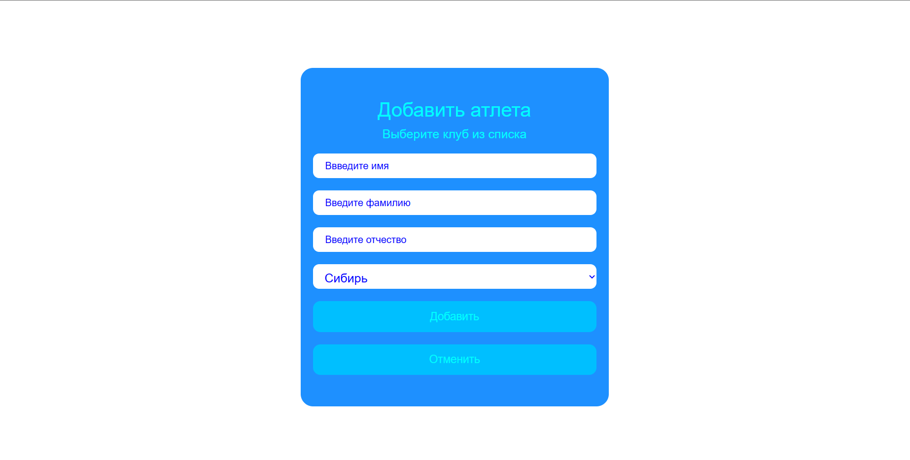
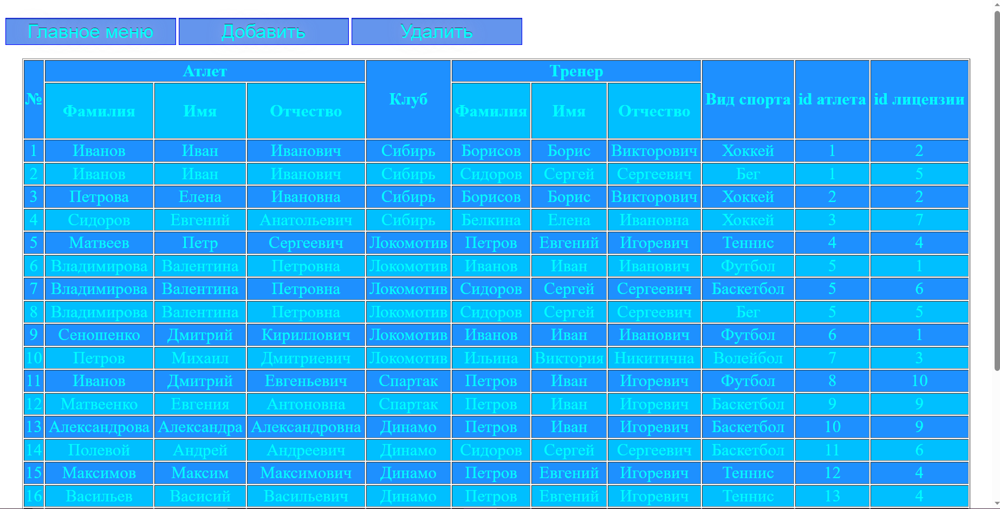
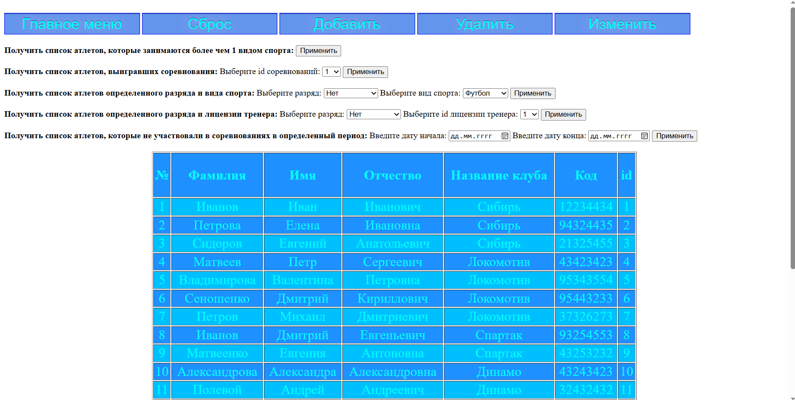

# DB-Project

This project is an authorization system built using Spring Security. It has 4 different roles: administrator, trainer, athlete, and user. The administrator has full access to all actions, while trainers and athletes cannot perform requests that contain an ID or make CRUD operations. The user can only view tables.

The administrator role cannot be obtained in the system, while the roles of coach and athlete can only be obtained by coaches and athletes from the table. However, anyone can become a user.

## Features

- Main menu with easy navigation
- Registration page for new users
- Page for adding new athletes
- Tables with data (administrator view only)
- Tests using Docker

## Technologies Used

- Spring Boot
- Spring Security
- Thymeleaf
- Thymeleaf + Spring Security

## Screenshots

### Main Menu

### Registration Page

### Add New Athlete

### Tables (Administrator View)

